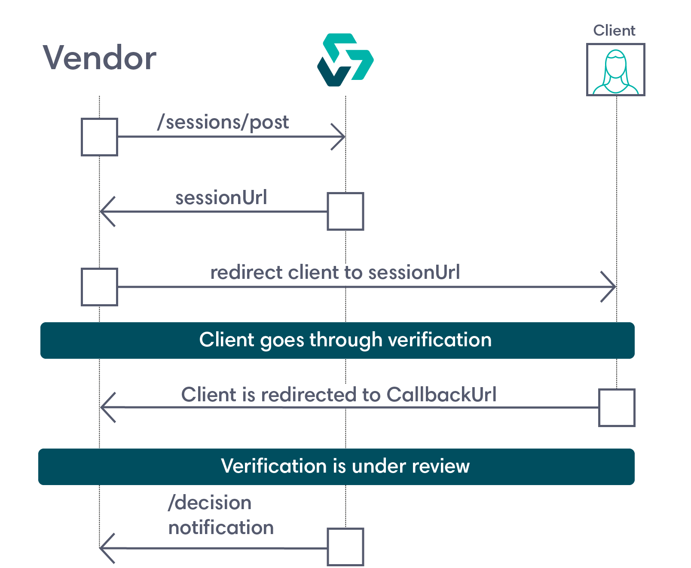

Sessions Lifecycle
==================

Here's the basic overview of how you can verify a user's identity using a Veriff verification session.

1. You start a verification flow for your vendor by posting to the ``https://<Base-URL>/v1/sessions`` endpoint a JSON object with details of the user to be verified.
   Make sure that the JSON object has the following:

   * Its Content-Type is set to ``application/json``
   * Its X-AUTH-CLIENT contains your API key
   * It contains the user's name, their verification document type, an optional redirect (callback) URL that you want the user to be sent to after completing verification, some optional vendor info, and an ISO 8601 timestamp.
      Here's an example payload:

      .. code:: json

         {
           "verification": {
               "callback": "https://veriff.com",
               "person": {
                   "firstName": "John",
                   "lastName": "Smith"
               },
               "document": {
                   "type": "PASSPORT",
                   "country": "EE"
               },
               "vendorData": "unique id of a user",
               "timestamp": "2022-08-03T18:46:08Z"
           }
         }

2. The Veriff sessions API responds with a session ID (a HS256-encrypted JSON web token, and a creation timestamp) that's valid for seven days, and a session URL to redirect your user to to start the verification process.

3. The user accesses the session URL, and the verification process kicks off.

4. The user completes the verification process, and Veriff redirects them to the callback URL provided in your JSON object in step 1.

   .. note:: If you didn't post a callback URL, the Integration's default callback URL will be used. You can set this up in `Station <https://station.veriff.com/integrations>`_.

5. You fetch a decision for the verification session using one of the following options:

   * `Webhooks <https://developers.veriff.com/#wait-for-webhook-response>`_
   * `The /sessions/{sessionID}/decision endpoint <https://developers.veriff.com/#sessions-sessionid-decision>`_